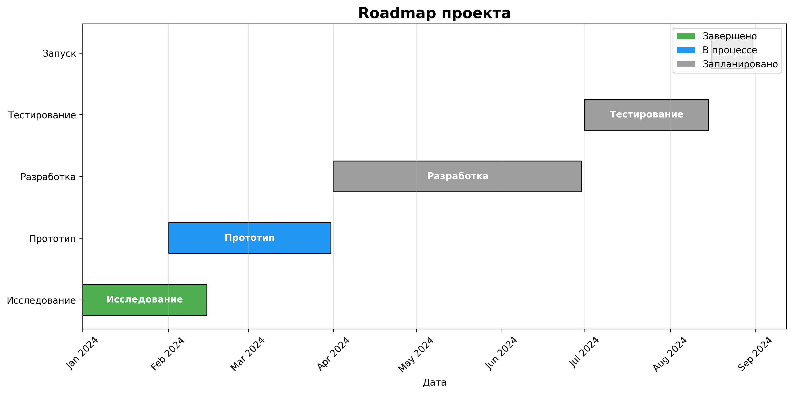

# Roadmap проекта

## Основные этапы:

| Этап | Статус | Начало | Окончание |
|------|--------|--------|-----------|
| Исследование | ✅ Завершено | 2024-01-01 | 2024-02-15 |
| Прототип | 🔄 В процессе | 2024-02-01 | 2024-03-31 |
| Разработка | 📅 Запланировано | 2024-04-01 | 2024-06-30 |
| Тестирование | 📅 Запланировано | 2024-07-01 | 2024-08-15 |
| Запуск | 📅 Запланировано | 2024-08-16 | 2024-08-31 |

## Описание этапов:
1. **Исследование** - анализ рынка и требований
2. **Прототип** - создание минимальной рабочей версии
3. **Разработка** - полная реализация функционала
4. **Тестирование** - проверка и отладка
5. **Запуск** - релиз продукта
